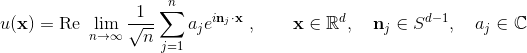

# rpws

Gridded evaluation of
samples from the real ensemble of Gaussian random plane waves in
two and three dimensions. MATLAB code driving NUFFT library.

### Alex H. Barnett, (c) 2006-2017

## Dependencies

- [MATLAB](http://mathworks.com) or octave
- [FINUFFT](http://github.com/ahbarnett/finufft)

## Description

These codes evaluates on a regular square (_d_=2) or cubical (_d_=3)
grid of points
a real-valued function _u_ drawn at random from a certain Gaussian random field
with zero mean, unit variance, and an isotropic
(radially symmetric) autocorrelation function.
There are two cases:

- alpha=1: "monochromatic" random plane waves.
_u_ is the real part of the
Fourier transform of Gaussian white noise living on the unit circle
or sphere.
This is M. V. Berry's 1977 model for chaotic eigenfunctions.
In other words,

<!---
used https://www.codecogs.com/latex/eqneditor.php
--->

where _aj_ is randomly drawn from a complex Gaussian,
and **n**_j_ is uniformly randomly drawn from the unit circle
or sphere.

Its autocorrelation function is the _J_0(_r_) Bessel function in 2D
or the spherical Bessel _j_0(_r_) = sin(_r_)/_r_ in 3D.

For some pictures in 2D see https://math.dartmouth.edu/~ahb/rpws/

- alpha=0: "Fubini-Study ensemble". _u_ is the real part of the
Fourier transform of Gaussian white noise uniformly filling the unit disc or
ball.
This is locally the same as a random homogeneous polynomial evaluated
on the unit sphere _Sd_, in the limit of large degree (zooming
in to a patch of the sphere it becomes Euclidean space).
Its autocorrelation function has faster decay
than for alpha=1, although it is still oscillatory.

## Basic usage

- `[u x] = rpw2dnufft(M, ppw, alpha);` outputs a 2D `M`-by-`M` grid of function values
`u` at the coordinates given by `x` along both axes, with `ppw` grid points per wavelength. `alpha` is 0 or 1 as described above.

- `[u x] = rpw3dnufft(M, ppw, alpha);` outputs a 3D `M`-by-`M`-by-`M` grid of function values
`u` at the coordinates given by `x` along all three axes, with `ppw` grid points per wavelength. `alpha` is 0 or 1 as described above.

See the MATLAB help documentation for these two functions for more options,
and timing information.

